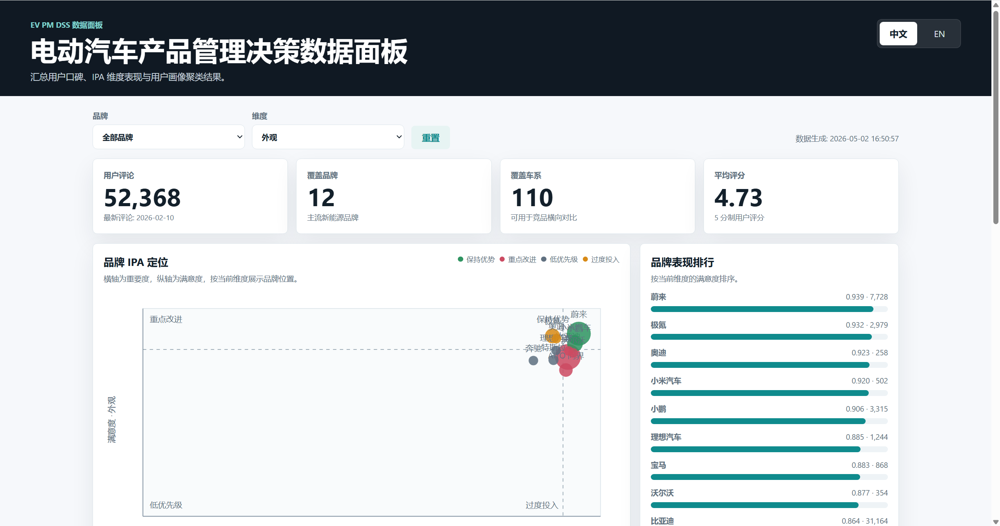
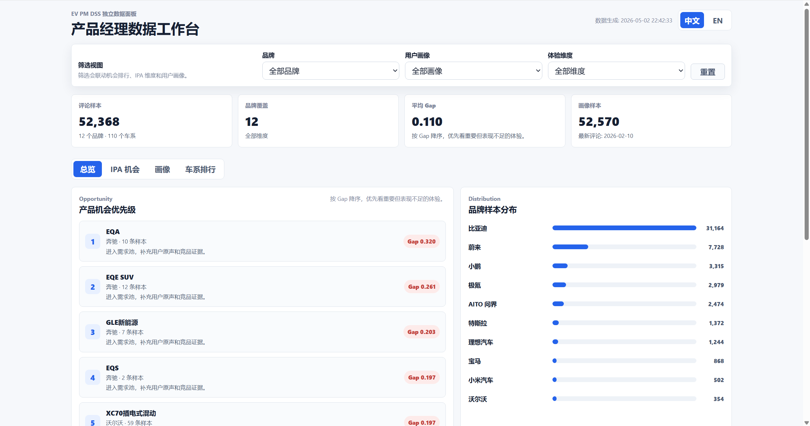
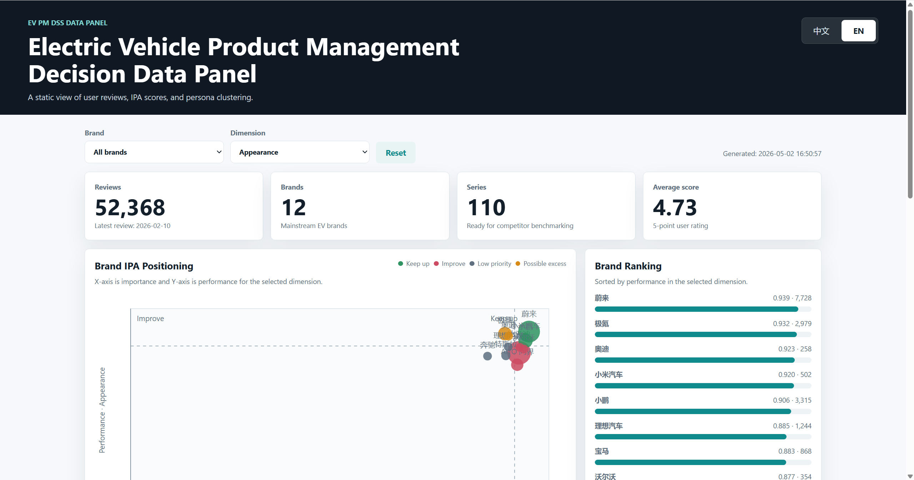
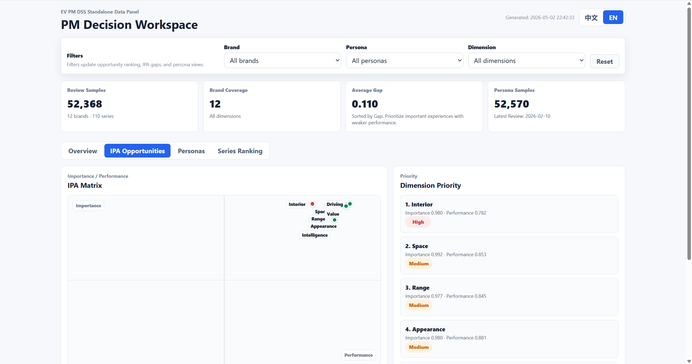
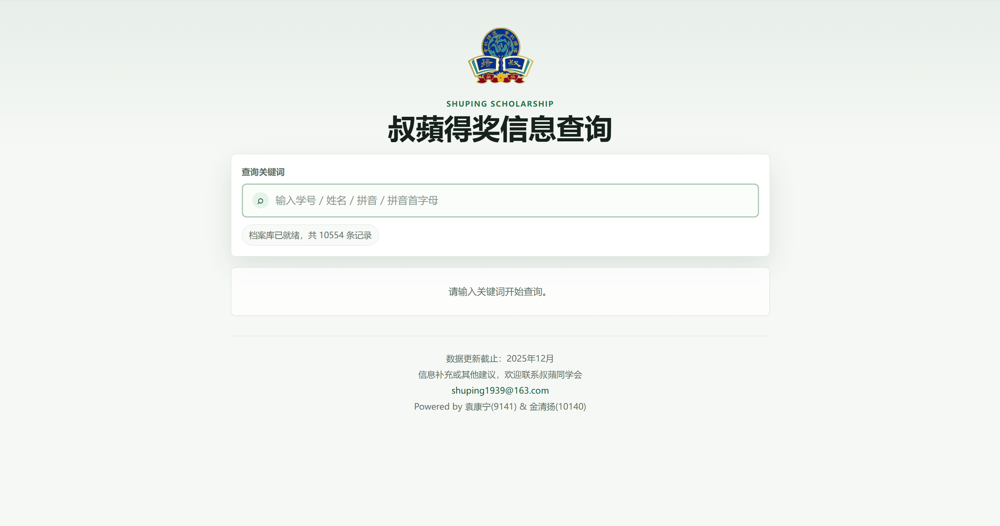
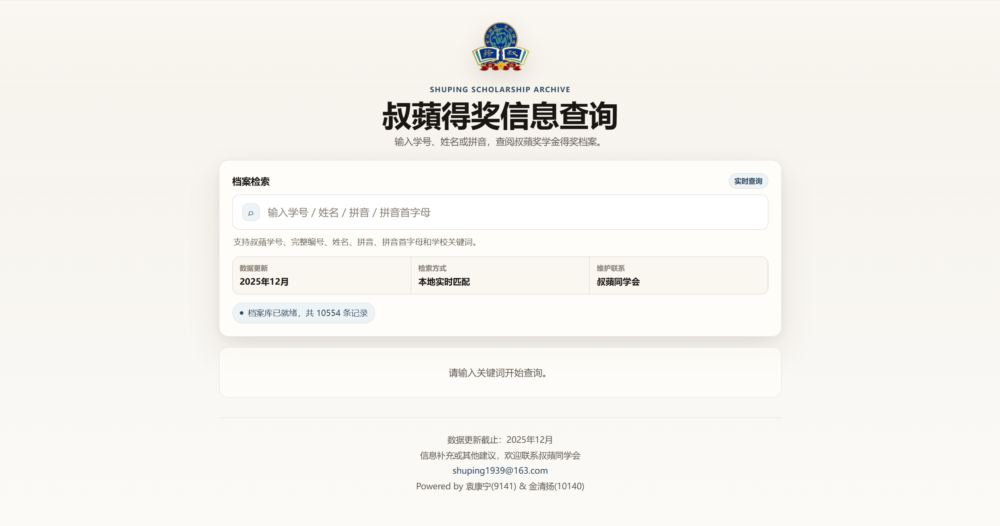

# Tasteful UI

**English** | [中文](./README.zh-CN.md)


A design skill that helps coding agents judge taste first, choose references second, and then implement UI.

In design work, process, taste, and references are equally important.

My current understanding of UI design is still limited, and the actual results of this skill may not be stunning. I hope it is still useful to developers with similar interests, mainly as a way to think about design process and agent workflow.

## Results

All examples use the Codex GPT-5.5 model.

### Data Panel

Original project: [EV-PM-DSS]()

Prompt:

```text
为当前项目设计一个面向产品经理的数据面板，可切换中英文，轻量级数据筛选交互
```

<table>
  <tr>
    <th width="50%">Direct agent 1</th>
    <th width="50%">With Tasteful UI 1</th>
  </tr>
  <tr>
    <td></td>
    <td></td>
  </tr>
  <tr>
    <th width="50%">Direct agent 2</th>
    <th width="50%">With Tasteful UI 2</th>
  </tr>
  <tr>
    <td></td>
    <td></td>
  </tr>
</table>

### Query UI

Original project: [scholarship-query](https://github.com/DonkeyKing01/scholarship-query)

Prompt:

```text
优化当前查询界面，保持简洁美观和用户信任感
```

<table>
  <tr>
    <th width="50%">Direct agent</th>
    <th width="50%">With Tasteful UI</th>
  </tr>
  <tr>
    <td></td>
    <td></td>
  </tr>
</table>

## References

This project is inspired by:

- [Claude Design Sys Prompt](https://github.com/elder-plinius/CL4R1T4S/blob/main/ANTHROPIC/Claude-Design-Sys-Prompt.txt): exploring taste;
- [awesome-design-md](https://github.com/VoltAgent/awesome-design-md): expressing and reusing styles;
- [Google DESIGN.md](https://github.com/google-labs-code/design.md): turning style into agent-executable rules;
- [21st.dev Magic](https://21st.dev/magic): generating and comparing multiple variants;
- [Refactoring UI](https://refactoringui.com/) / [NNGroup](https://www.nngroup.com/articles/principles-visual-design/) / [Laws of UX](https://lawsofux.com/): evaluating UI quality.

## Structure

```text
tasteful-ui/
├── SKILL.md
├── modes/
├── taste/
├── references/
├── formats/
├── workflows/
└── eval/
```

### SKILL.md

Router + operating principles.

It decides:

- which mode the task should enter;
- which files should be loaded;
- which investment gates must stop;
- how to hand off the result.

### modes/

Task modes.

- `taste_first_redesign.md`: default mode. Used for redesigns, personal websites, dashboards, landing pages, query pages, and other tasks without confirmed taste;
- `production_ui_implementation.md`: only used when there is a clear design brief / mockup / screenshot / taste direction;
- `design_critique_only.md`: used for ranking screenshots, scoring, and diagnosis without editing code.

### taste/

Taste judgment system.

- `taste_exploration.md`: decide what the product should become first;
- `taste_critic.md`: critique whether a direction or result is actually good;
- `anti_generic_rules.md`: prevent generic SaaS, dark dashboard, fake premium, and template-like output.

### references/

External style material.

`catalog.md` finds supporting references for the confirmed taste direction.

References are material, not the direction itself.

### formats/

Design document formats.

`PROJECT_DESIGN.template.md` turns taste, project context, and external references into agent-executable design rules.

### workflows/

Execution workflows.

- `variation_first.md`: when direction is uncertain, compare multiple taste directions first;
- `implementation.md`: implement after the brief is confirmed;
- `verification.md`: technical verification + visual verification.

### eval/

Result evaluation system.

`ui_result_critique.md` judges:

- whether the result is better than the original UI;
- whether references helped or limited the design;
- whether the result only looks more like a template;
- whether some design choices should be rolled back.

## Workflow

1. Understand the user's task
2. Read project context
3. Stop at the project understanding investment gate
4. Explore taste
5. Stop at the taste direction investment gate
6. Route `catalog.md` according to the taste direction
7. Write `PROJECT_DESIGN.md` / `design.md`
8. Stop at the design brief investment gate
9. Implement from the brief
10. Verify
11. Judge whether the design result is actually better
12. Handoff

## Install

### Codex

```bash
git clone https://github.com/DonkeyKing01/tasteful-ui-skill.git
cp -r tasteful-ui-skill/tasteful-ui ~/.codex/skills/tasteful-ui
```

### Claude Code

```bash
git clone https://github.com/DonkeyKing01/tasteful-ui-skill.git
cp -r tasteful-ui-skill/tasteful-ui ~/.claude/skills/tasteful-ui
```

### Manual

Preserve this structure and copy it into the agent's skills folder:

```text
tasteful-ui/
  SKILL.md
  modes/
  taste/
  references/
  formats/
  workflows/
  eval/
```

## License

MIT
